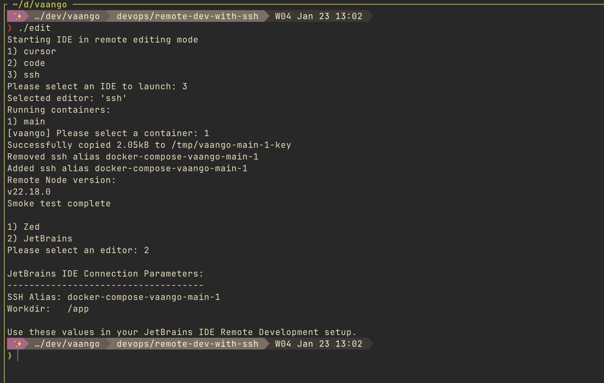
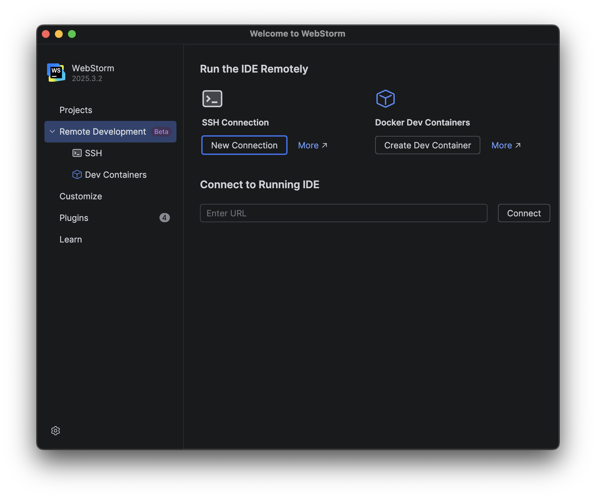
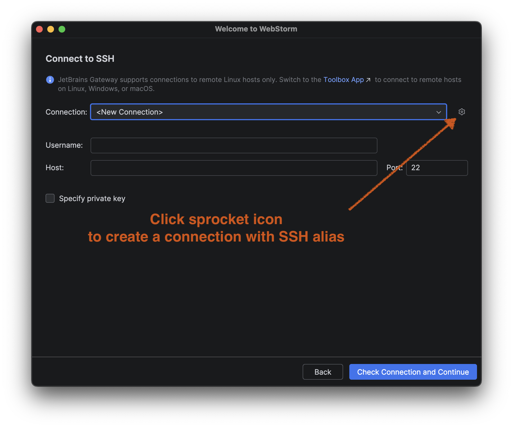
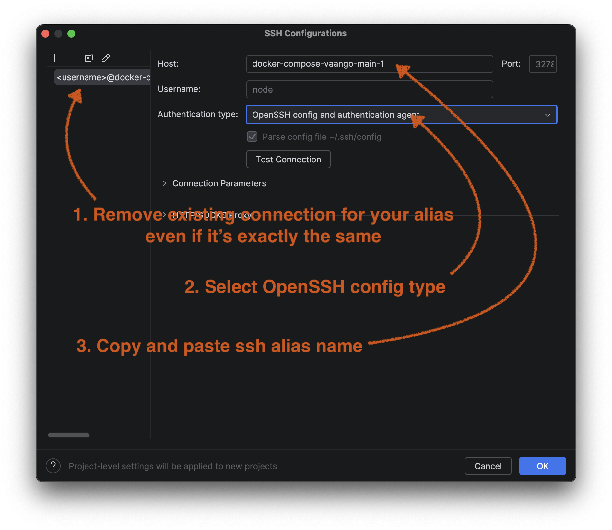
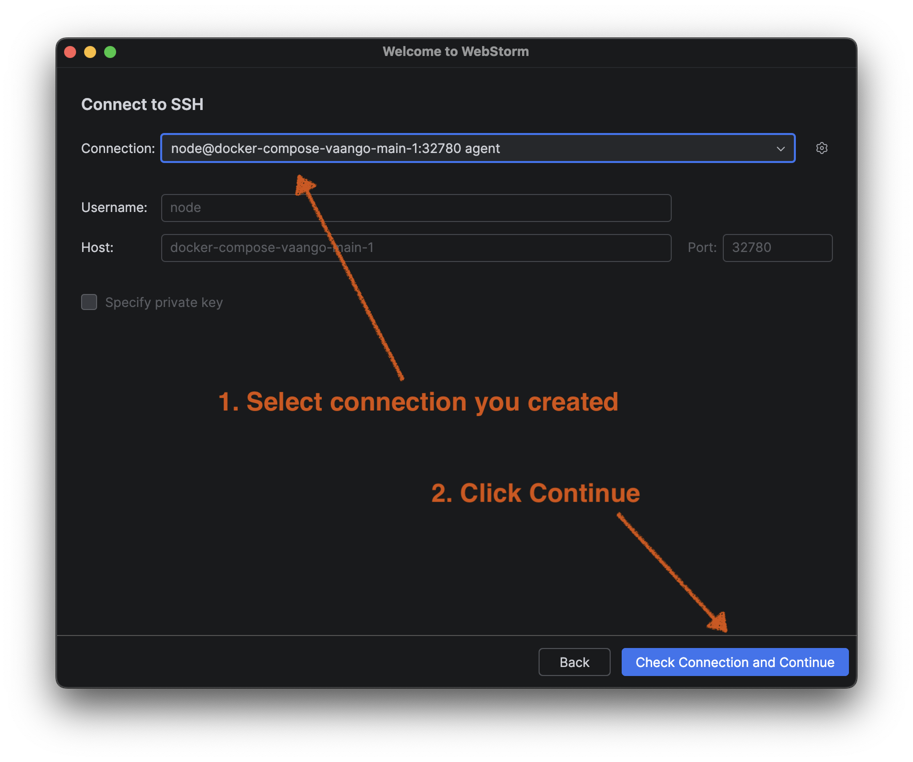
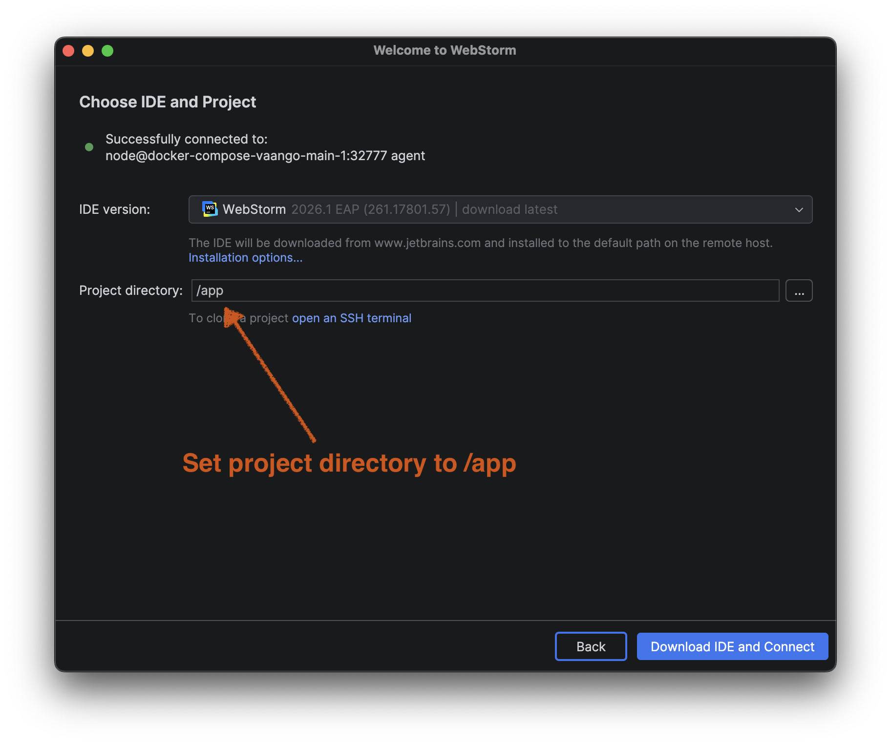
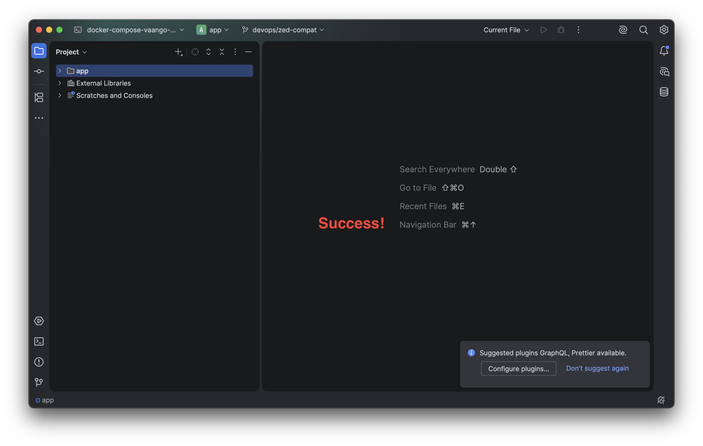

# Remote Development Over SSH

## Zed editor

- Open Zed editor.
- Run the `cli: install` command from the command palette (cmd-shift-p) to install the zed CLI.
- Open a new terminal window on your host computer.
- Navigate to the project folder.
- Start up the Docker-based development environment with `./up` command.
- In another terminal window on your host computer, run `./edit` command.
- Follow the interactive prompts and select `ssh` in editor prompt, then select `Zed`
- Zed should connect to the container automatically.

## Jetbrains IDEs - WebStorm, PHPStorm

### Prerequisites

- Open a new terminal window on your host computer.
- Start up the Docker-based development environment with `./up` command.
- In another terminal window on your host computer, run `./edit` command.
- Follow the interactive prompts and select `ssh` in editor prompt, then select `JetBrains`.

### Connecting via JetBrains Gateway

1. Open Webstorm and click on **SSH** under "Remote Development".

2. Click the sprocket icon next to the New Connection dropdown to create a new SSH connection.

3. Enter the SSH alias that was configured by the `./edit` command

4. Select your newly created connection from the list.

5. Set the project folder path on the remote container to `/app`.

6. Once connected, you should see a success message and the IDE will open with remote development enabled.

